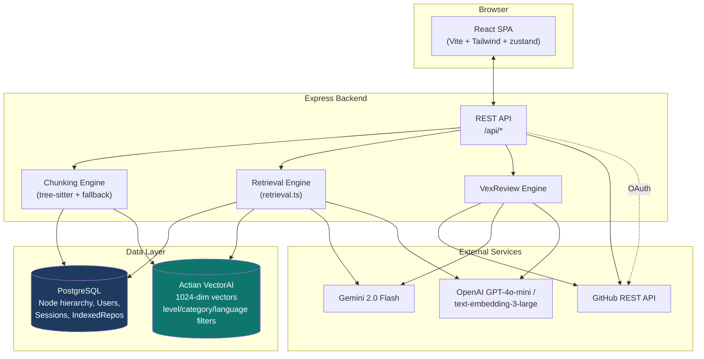
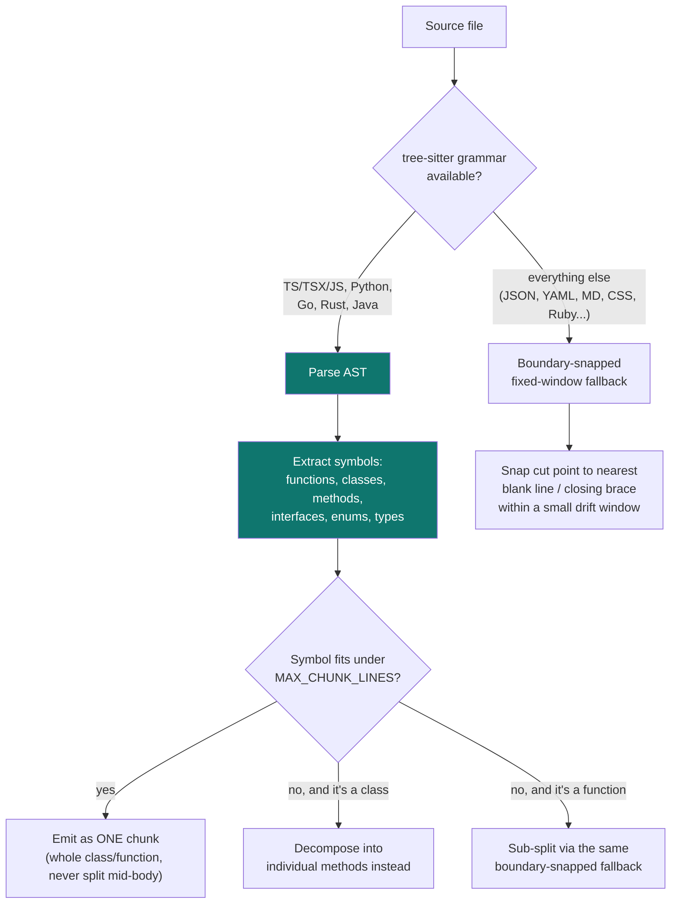
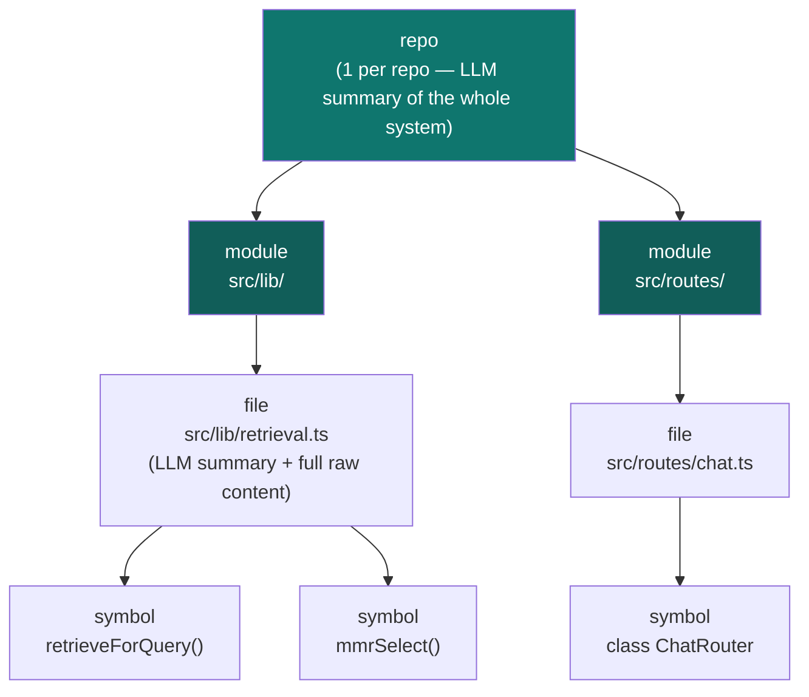
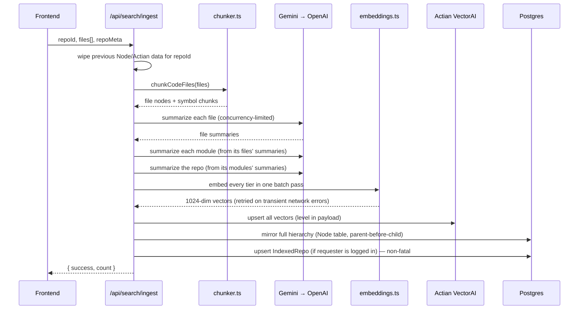
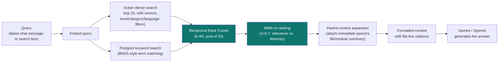
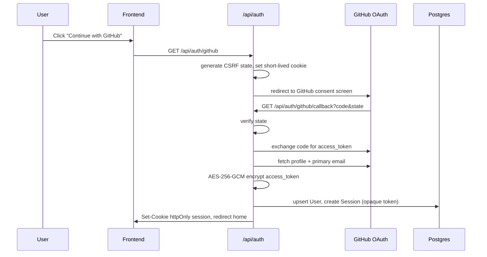

# GitPlus

**Paste a GitHub repo. Get a codebase that actually understands itself.**

GitPlus indexes a repository into a real, queryable knowledge structure — not a
single giant prompt — and answers questions about it with cited, line-accurate
context pulled fresh on every message. It also generates onboarding docs,
security audits, system design docs, and (via VexReview) AI pull-request
reviews, all grounded in the same retrieval pipeline.

Built for the **Accio Relevance — Build with Actian VectorAI Database** track.
The retrieval architecture below — AST-aware chunking, a 4-tier hierarchy, and
dense+sparse fusion with MMR diversification — is the actual differentiator,
not a checkbox integration.

---

## Table of contents

- [Tech stack](#tech-stack)
- [System architecture](#system-architecture)
- [Chunking strategy](#chunking-strategy)
- [Hierarchical RAG](#hierarchical-rag)
- [Actian VectorAI usage](#actian-vectorai-usage)
- [Ingest pipeline](#ingest-pipeline)
- [Retrieval pipeline](#retrieval-pipeline)
- [Authentication](#authentication)
- [VexReview: AI PR reviewer](#vexreview-ai-pr-reviewer)
- [API reference](#api-reference)
- [Fallbacks & resilience](#fallbacks--resilience)
- [Security](#security)
- [Local setup](#local-setup)

---

## Tech stack

| Layer | Technology |
|---|---|
| Frontend | React 19, Vite, TypeScript, Tailwind CSS, shadcn/ui (Radix primitives), zustand, framer-motion |
| Backend | Node.js, Express 5, TypeScript |
| Relational DB | PostgreSQL (Neon or local Docker), Prisma ORM 7 (driver adapter: `@prisma/adapter-pg`) |
| Vector DB | **Actian VectorAI** (self-hosted via Docker ) |
| Embeddings | OpenAI `text-embedding-3-large`, truncated to 1024 dims via OpenAI's native `dimensions` param |
| LLM (chat / summarization / review) | Google Gemini 2.0 Flash (primary) → OpenAI GPT-4o-mini (fallback), automatic failover |
| Code parsing | tree-sitter (WASM, via `web-tree-sitter` + `tree-sitter-wasms`) — TS/TSX/JS, Python, Go, Rust, Java |
| Auth | GitHub OAuth (hand-rolled, not a third-party auth provider), AES-256-GCM token encryption at rest |
| GitHub API | Octokit (`@octokit/rest`) |

---

## System architecture



---

## Chunking strategy

Most RAG-over-code systems chunk by fixed line windows. That's simple, but it
routinely slices a function or class in half, handing the model a fragment
instead of a coherent unit. GitPlus instead parses the file into a real syntax
tree and chunks by **symbol**:



**Rules, concretely** (`server/src/lib/chunker.ts`, `symbolExtractor.ts`):
- One chunk = one semantic symbol. A class small enough to fit the size cap is
  kept whole; an oversized one is decomposed into its individual methods rather
  than cut at an arbitrary line.
- Every chunk's embedding text is prefixed with a small contextual header
  (`// File: ... // Symbol: Class.method (method)`) — this is the same idea as
  "contextual retrieval": a 3-line getter embedded on its own has almost no
  signal, but with its file/parent path attached it becomes distinguishable.
- Unsupported languages, and Ruby specifically (its prebuilt WASM grammar has a
  real ABI incompatibility that was discovered and reproduced during
  development — it loads but crashes at parse time), fall back to a
  boundary-snapped fixed window: the same sliding-window idea most naive
  chunkers use, but the cut point is nudged forward to the nearest blank line
  or closing brace instead of landing wherever the line count happens to end.

---

## Hierarchical RAG

Chunking alone doesn't answer "what does this repo do" — a symbol-level chunk
is the wrong granularity for a broad question. GitPlus builds **four tiers**
per repository, each summarized and embedded independently, forming a real
tree in Postgres (self-referencing `parentId` on the `Node` model):



A vague question ("what does this app do?") matches best against repo/module
summaries. A specific one ("where do we handle rate limiting?") matches best
against symbol-level code. Both live in the same Actian collection, and
`level` is a filterable payload field — so this hierarchy is also GitPlus's
concrete use of Actian's **Filtered Search** pattern, not a separate feature.

Each file-level node also stores the **full raw file content** in Postgres
(not just its embedding) — this is the "huge context" layer: retrieval can
expand a small symbol hit up to its complete surrounding file when needed,
without that file content ever being sent to the embedding model.

---

## Actian VectorAI usage

One collection (`gitplus_nodes_v3`, 1024-dim, cosine distance) holds all four
tiers. Two of the track's three advanced patterns are used for real, end to
end — not as a token integration:

| Pattern | Where |
|---|---|
| **Hybrid Fusion** | `hybridSearch.ts` — Actian dense search fused with a Postgres BM25-style keyword search via Reciprocal Rank Fusion (RRF), using the SDK's own `reciprocalRankFusion` where available, with a manual RRF fallback |
| **Filtered Search** | `actian.ts` `vectorSearch()` — payload filters on `repoId`, `level`, `category`, `language`, applied via the SDK's real `Field`/`Filter` classes |

**Named Vectors** (a second embedding space per point) was scoped in an early
design doc but not shipped — the hierarchical `level`-filtered single-space
design ended up covering the same "different granularities need different
retrieval" problem more directly, so it was deprioritized in favor of finishing
the retrieval pipeline itself (MMR, per-turn RAG chat) rather than building a
second pattern for its own sake.

**Two real integration bugs found and fixed** against the actual Actian
server (not assumptions from docs):
1. **Point IDs must be valid UUIDs.** GitPlus's own node IDs
   (`repoId::path:startLine-endLine`) aren't UUID-shaped. Fixed with a
   deterministic SHA-256-derived UUID as the Actian-side point ID, with the
   real node ID carried in `payload.nodeId` — so upserts are idempotent
   (re-ingest updates the same point) and every caller downstream of
   `vectorSearch()` only ever sees GitPlus's own IDs.
2. **The filter parameter needs a real `Field`/`Filter` class instance**, not
   a plain `{ must: [...] }` object — the SDK's `points.search()` calls
   `.isEmpty()` on whatever it's given. A plain object throws
   `filter.isEmpty is not a function` at runtime. Both `vectorSearch()` and
   `deleteByRepo()` build filters via `new Field(...).eq(...)`, chained with
   `.and(...)` for multiple conditions.

---

## Ingest pipeline

`POST /api/search/ingest` (`server/src/routes/search.ts`):



Re-indexing the same `repoId` is idempotent: it wipes and rebuilds rather than
accumulating stale chunks.

---

## Retrieval pipeline

This is what actually runs on every chat message and every hybrid search
query (`server/src/lib/retrieval.ts`) — real per-turn retrieval, not a static
context blob decided once at index time:



**Why MMR matters**: RRF alone can return several near-duplicate chunks from
the same file (e.g. five overlapping test cases in one file), crowding out
everything else. MMR greedily picks the next chunk that maximizes
`λ · relevance − (1−λ) · max_similarity_to_already_selected`, so the final set
handed to the LLM is diverse, not just individually high-scoring.

**Real per-turn RAG**: `chat.ts` takes the latest user message, runs this
exact pipeline against the repo's `repoId`, and injects the result as context
— every turn, fresh. It falls back to the frontend-supplied static
`repoContext` only if `repoId` is missing or retrieval returns nothing (e.g.
the repo hasn't been ingested yet).

---

## Authentication



- The GitHub access token is **encrypted at rest** (AES-256-GCM,
  `server/src/lib/crypto.ts`) — never stored or logged in plaintext.
- Sessions are opaque, high-entropy random tokens stored server-side
  (`Session` table), not a self-encoding JWT — revoking a session is a DB
  delete, not a signing-key rotation.
- `githubAuth.ts` resolves the GitHub token per-request as *explicit param >
  logged-in session's stored token* — a logged-in user automatically gets
  5,000 req/hr instead of the unauthenticated 60 req/hr on every GitHub API
  call the backend makes on their behalf, with zero frontend changes required.

---

## VexReview: AI PR reviewer

VexReview started as a standalone GitHub Action
([`VexReviewer/`](./VexReviewer)) that reviews pull requests when triggered by
a `pull_request` CI event. Its review engine (diff parsing, hunk-level prompt
construction, incremental "only review what changed since last review" logic)
is genuinely solid — the integration into GitPlus reuses it as a library
instead of asking users to install a separate GitHub Action:

- Runs **inside the GitPlus backend** on demand — no workflow file, no
  repo secrets, no new GitHub OAuth scope. A user with a repo connected via
  GitHub OAuth can trigger a review of any open PR directly from the
  dashboard.
- Reuses the same Gemini→OpenAI failover (`llm.ts`) as chat and summarization,
  and the user's own encrypted GitHub OAuth token to post the review as
  themselves via Octokit.
- Ported components: diff/hunk parsing, prompt templates, and the
  `Commenter` (which manages the summary comment, inline review comments, and
  incremental re-review via commit-ID tracking) — stripped of the
  `@actions/core`/`@actions/github` GitHub-Actions-runner coupling the
  original relied on.
- **Deliberately not ported**: the original auto-closed a PR when it detected
  a committed secret/credential file. Force-closing someone's PR from a
  dashboard button is too destructive for a user-triggered action — GitPlus
  reports sensitive-file detections instead of acting on them unilaterally.

---

## API reference

All routes are mounted under `/api` in `server/src/index.ts`.

| Route | Method(s) | Purpose |
|---|---|---|
| `/api/auth/github`, `/github/callback` | GET | GitHub OAuth login flow |
| `/api/auth/me` | GET | Current session's user |
| `/api/auth/repos` | GET | The user's raw GitHub repos (for the index picker) |
| `/api/auth/indexed-repos` | GET | Repos this user has analyzed on GitPlus ("My Repos") |
| `/api/auth/logout` | POST | Destroy the session |
| `/api/repo/index` | POST | Fetch a repo's file tree + contents from GitHub (full or on-demand mode) |
| `/api/repo/file`, `/fetch-batch` | POST | On-demand single/batch file fetch |
| `/api/repo/issues`, `/pulls`, `/commits`, `/pulls/:pr/diff` | GET/POST | GitHub issues/PRs/commits passthrough |
| `/api/search/ingest` | POST | Chunk → summarize → embed → index a repo (Actian + Postgres) |
| `/api/search/hybrid` | POST | Dense+sparse fused, MMR-diversified search over an indexed repo |
| `/api/chat` | POST | SSE-streamed chat (`chat` action) or JSON (`overview`/`security`/`onboarding`/`system-design` actions), with per-turn RAG when `repoId` is present |
| `/api/sessions` | POST/GET/PUT | Shareable chat session persistence (no login required) |
| `/api/visits/track`, `/stats` | POST/GET | Anonymous visitor counter |

---

## Fallbacks & resilience

- **LLM provider failover**: Gemini 2.0 Flash tried first, OpenAI GPT-4o-mini
  as fallback, with a 60s cooldown on a provider after it 429s — shared by
  chat, summarization, and VexReview (`llm.ts`).
- **Embeddings retry-with-backoff**: `embeddings.ts` retries transient network
  failures (`ECONNRESET`, `ETIMEDOUT`, 429, 5xx) up to 3 times with exponential
  backoff. This was added after a real production incident: an uncaught
  network error here used to silently abort an entire ingest *after* all the
  expensive summarization work had already succeeded.
- **Graceful grammar degradation**: if a tree-sitter grammar fails at parse
  time (observed with Ruby's prebuilt WASM binary), that language is disabled
  for the rest of the process and falls back to boundary-snapped chunking
  instead of crashing ingestion.
- **Non-fatal side-effects**: the `IndexedRepo` association write (powers "My
  Repos") is wrapped so a failure there can't roll back an otherwise-successful
  ingest — worst case is "re-index to pick it up in the list," not losing the
  whole ingest.
- **RRF fallback**: hybrid search tries the Actian SDK's own
  `reciprocalRankFusion` first, falling back to a manual RRF calculation if
  the SDK call throws or returns nothing usable.

---

## Security

- GitHub OAuth tokens encrypted at rest (AES-256-GCM), never logged.
- Opaque server-side session tokens in httpOnly cookies (not client-readable,
  not a forgeable JWT).
- CORS locked to a configured `FRONTEND_URL` with `credentials: true` (not
  `origin: "*"`, which is incompatible with credentialed cookies anyway).
- Rate limiting on all `/api/*` routes (`express-rate-limit`).
- Actian's own delete/filter operations go through the real SDK client
  consistently — no raw REST bypass.

---

## Local setup

**Prerequisites**: Node.js, Docker, a GitHub OAuth App, and API keys for
Google Gemini and OpenAI.

```bash
# 1. Start Postgres + Actian VectorAI
cd server
docker compose up -d

# 2. Configure environment
cp .env.example .env   # fill in DATABASE_URL, GOOGLE_GEMINI_API_KEY,
                        # OPENAI_API_KEY, GITHUB_CLIENT_ID/SECRET,
                        # ENCRYPTION_KEY (32-byte hex), FRONTEND_URL

# 3. Install deps, sync schema, run the server
npm install
npx prisma db push
npm run dev             # http://localhost:3000

# 4. Frontend, in a second terminal
cd ../frontend
npm install
npm run dev              # http://localhost:8080
```

The Actian dashboard (Console / Collections browser / License Manager) is
reachable at `http://localhost:6575` once the container is up — useful for
inspecting the `gitplus_nodes_v3` collection directly.
